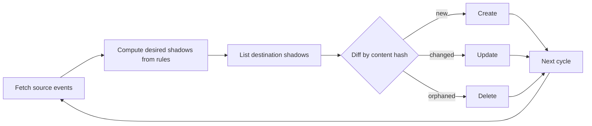

Declarative, Kubernetes-first calendar sync. Meridian mirrors events between Google Calendar and CalDAV calendars as rule-based, transformed copies, configured entirely as code and running as a single stateless pod.

The canonical example: every appointment on your private calendar shows up as an anonymous **Busy** block on your work calendar. Colleagues see when you're free. They don't see why you aren't.

> [!IMPORTANT]
> **Status: pre-alpha, running unattended in production on one deployment.** The design is settled (see [Design]({})) and the engine handles real traffic daily. The public interface — `rules.yaml`, the Helm chart, the CLI — may still change without notice before `v1.0.0`.

## Is this for you?

Meridian does one thing. It copies events one way, from calendars you name to calendars you name, applying filters and transforms you wrote down in YAML.

**Good fit if:**

- You already run Kubernetes and want sync rules living in Git alongside everything else you deploy.
- You want one-way mirrors with transformed content, like stripping titles down to "Busy".
- You're syncing your own calendars, not running a service for other people.

**Not a fit if:**

- You want scheduling: finding meeting slots, negotiating free/busy, moving things around. Meridian copies events. It holds no opinions about how you should spend your week.
- You need a genuine two-way merge, where edits on either side flow back to the other.
- You need multi-user or multi-tenant operation from a single install.
- You need Exchange, Outlook, or Microsoft 365. Only Google Calendar and CalDAV are supported.

The full list of constraints lives on [Limitations]({}), and it's worth two minutes before you invest more. The [FAQ]({}) answers why it's built this way.

## How it works

Meridian reconciles the way a Kubernetes controller does. Each cycle it fetches every event in a rolling window from your source and destination calendars, works out which copies *should* exist, and makes the destination match: create, update, or delete.

Those copies are called **shadows**, and every one carries an ownership marker naming the instance and rule that created it. Meridian only ever touches shadows it made itself. Your own events, and other tools' events, are invisible to it.

There's no database and no sync cursor. The calendars hold the state. That means a crashed pod, a restored backup, or a config change all converge the same way: by looking at what's there and fixing the difference.

## Where to go next


  
  
  
  
  

