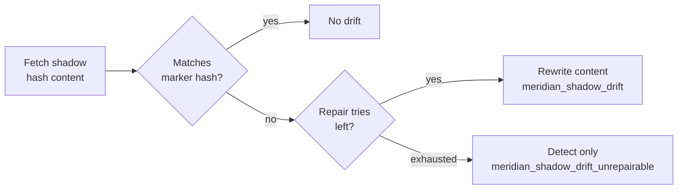
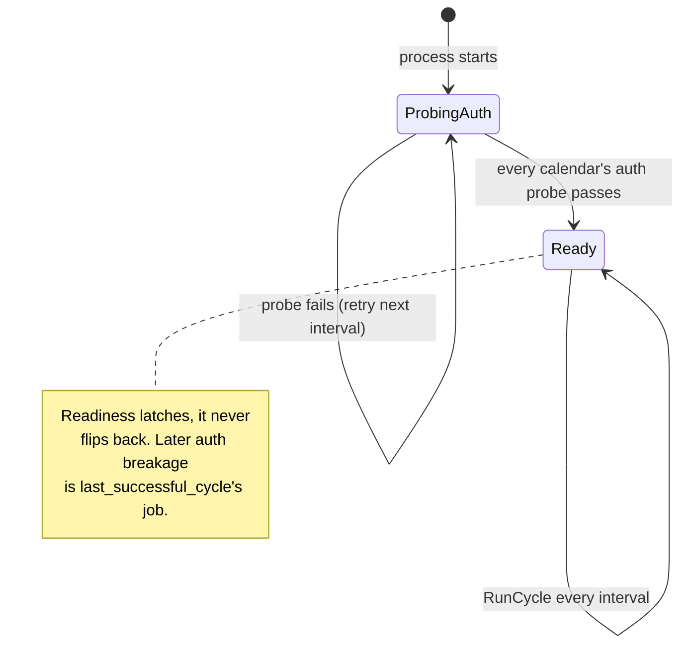

The [landing page]({}) has the one-paragraph version of how reconciliation works. This page is the layer underneath it.

It's organized by the things Meridian operates on rather than by the order the decisions were made, so a section here maps roughly onto the package you'd be editing.

## The cycle

Every cycle fetches all events in the sync window from each source and destination, computes the copies the rules call for, and diffs that against what's actually there. Level-triggered reconciliation, the way a Kubernetes controller works.

**The calendars are the state.** No sync cursors, no state database, no persistence layer of any kind. A crashed pod, a restored backup and a config change all converge the same way: by looking at what's there and fixing the difference.

**Each rule is an independent reconciliation.** If a rule's source fetch or shadow listing fails, that rule's cycle aborts with no writes and no collection, while every other rule proceeds normally.

**The next cycle is the retry.** There is no retry machinery, no backoff, no queue. The configured `interval` is the entire retry policy, including after a rate limit. Nothing sleeps, nothing persists, nothing gets stuck.

**Window fetches are shared per calendar.** One fetch feeds every rule reading from that calendar within a cycle.

## The marker

Every copy Meridian writes carries a marker. It is the only cross-cycle state that exists.

| Field | Google (`extendedProperties.private`) | CalDAV (VEVENT property) | Content |
|---|---|---|---|
| Source ref | `meridian.src` | `X-MERIDIAN-SRC` | Source calendar ID, event UID and recurrence instance, readable rather than hashed |
| Rule ID | `meridian.rule` | `X-MERIDIAN-RULE` | The rule that created this copy |
| Content hash | `meridian.hash` | `X-MERIDIAN-HASH` | Hash of the post-transform intended content |
| Instance ID | `meridian.instance` | `X-MERIDIAN-INSTANCE` | This instance's identity |
| Schema version | `meridian.v` | `X-MERIDIAN-V` | Marker format version |
| Repair tries | `meridian.repair` | `X-MERIDIAN-REPAIR` | Bounded drift-repair attempts against the current hash |

**Ownership is instance plus rule.** Two rules never contend over the same copy, and several Meridian instances can feed one destination calendar without seeing each other at all.

**Change detection reads the marker, never the event.** Meridian computes the intended content, hashes it, and compares against the hash stored in the marker. Provider-returned values are never compared directly, which makes server-side normalization structurally irrelevant. Whitespace changes, field coercion and reordering cannot trigger a spurious update.

**Old markers stay readable forever.** Every version Meridian has written decodes into the current representation, with new fields defaulting to their historically correct value. A copy written before repair-counting existed had zero repairs, not an unknown number. Writes always stamp the current version, so ordinary reconciliation upgrades markers as a side effect.

A dedicated migration is reserved for the one case this can't cover: an old shape that cannot decode into the new one at all, because a field was removed or the identity encoding changed.

### Tamper semantics

Trusting the marker has a consequence. A hand-edit that preserves the marker is indistinguishable from provider normalization, since both arrive as "the content hash doesn't match the marker's hash".

**The response is bounded repair.** On drift, Meridian rewrites the intended content up to a small number of tries, then falls back to detect-only and a separately alertable metric. That self-heals hand-edits, and it degrades safely against a provider that keeps normalizing something. The bound is what makes repair safe; it isn't a claim that observed content became trustworthy.

Manual *deletions* are always healed, regardless of the bound. Resurrection is the one service Meridian offers unconditionally.



### Sweep

Each cycle, every account discovers its writable calendars and deletes its own copies from any calendar its rules no longer target: a removed rule, a renamed ID, a dropped destination, a stray on a calendar never configured.

Only this instance's markers are ever touched, active pairings are left alone even when their cycle aborted, and the sweep is windowed.

**Current config plus sync window is reconciled automatically. Outside that, `meridian wipe`.**

Google gives a bonus here. Owned copies are server-side queryable via `privateExtendedProperty`, so listing and wiping never fetch foreign events at all.

## The copy

**Copies are always discrete single events**, however the source expressed the recurrence.

**Updates are full replacements.** Content and marker are written together, never as a partial patch. That's what keeps hash-based change detection sound, since a partial update could leave a hash matching neither the old content nor the new.

**Last writer wins.** No optimistic concurrency, no conditional writes. Copies are meridian-owned by design, so a hand-edit is expected to be overwritten and a hand-deletion expected to be undone. Conditional writes would protect a manual edit for at most one cycle before reconciliation overwrote it anyway, which is an illusion of safety rather than safety.

**Deletes are idempotent.** A missing or `410 Gone` event counts as success.

## The rule

One rule shape, with typed and schema-validated `filter` and `transform` blocks covering the large majority of cases, plus two bounded escape hatches.

**`filter.when` takes a [CEL](https://cel.dev/) predicate** over a small documented event schema, ANDed with the typed fields. It compiles and type-checks at startup, so a bad expression fails config load rather than surfacing mid-sync. CEL is already the Kubernetes ecosystem's embedded expression language, used in CRD validation and `ValidatingAdmissionPolicy`: non-Turing-complete, sandboxed, guaranteed to terminate, incapable of I/O.

**Go templates handle `title`, `description` and `location`.** The event field set is finite, so typed fields plus templating cover the space.

**Transforms are weaker than filters on purpose.** A bad filter selects the wrong events. A bad transform corrupts calendar content, which is meaningfully worse. Conditional transforms fall out of writing two rules with disjoint `when` predicates, and rule-scoped markers guarantee those two can never fight.

Computed transforms such as time-shifting or padding are expected to arrive as new typed fields with engine-controlled logic, never as a general expression hook into content.

**The event schema became a public API surface** the moment `filter.when` shipped, and is versioned accordingly.

## The adapter

Both providers implement one identical interface. No capability flags, no engine-side branching on provider type.

```go
type CalendarAdapter interface {
    ListEvents(ctx, window) ([]Event, error)   // expanded instances overlapping window (sources)
    ListShadows(ctx, window) ([]Shadow, error) // meridian-owned copies overlapping window (destinations)
    Create(ctx, Shadow) error
    Update(ctx, Shadow) error                  // full replace: content + marker in one write
    Delete(ctx, ShadowRef) error               // idempotent: 404/410 counts as success
}
```

**Protocol asymmetry stays inside the adapter.** Google's `ListShadows` uses a server-side property query; CalDAV fetches the window and filters locally. The engine never knows which.

**Nothing provider-specific crosses the boundary.** The normalized `Event` carries UTC instants, the `AllDay` flag, the CEL schema fields and the marker.

**One asymmetry the adapter cannot absorb: knowing which attendee is you.** Reading the calendar owner's own RSVP means picking their entry out of the attendee list, and Google's API marks it while iCalendar has no equivalent. The adapter can't invent the answer, so a CalDAV account names its own addresses in `identities` and a Google account needs nothing. Guessing the owner from attendee data was tried and rejected: the addresses appearing most often on a work calendar belong to whoever schedules the most meetings, and reading a colleague's response as yours fails silently. Without `identities`, RSVP is simply empty, and a rule that asks for it against such a source fails at config load instead of quietly matching nothing.

### Error taxonomy

Adapters normalize every provider error into one of four classes the engine acts on uniformly:

- `NotFound` / `Gone` — treat as already deleted.
- `RateLimited` — end this rule's cycle; the next scheduled one retries.
- `AuthFailed` — fatal, alert loudly.
- `Transient` — skip this cycle, and feed the mass-delete guard, since from inside a naive check a transient failure looks exactly like an empty source.

## Recurrence and time

**Recurring events are expanded by the provider**, on both protocols: `events.list` with `singleEvents=true` on Google, the `expand` element of a calendar-query REPORT on CalDAV. Expansion is only ever needed on sources.

Client-side expansion would reimplement the machinery that dominates every sync tool's bug tracker: pairing overridden instances, `EXDATE` edges, re-materializing a series after its rule changes. Server-expanded instances also arrive as resolved UTC instants, so there's no timezone-ID parsing and no exposure to the non-IANA timezone identifiers some calendar exports still contain.

Because reconciliation re-derives the whole instance set each cycle, a changed recurrence rule needs no special handling. Stale copies are swept as orphans and new ones appear as ordinary creates.

The cost is a hard dependency on the provider expanding correctly. If one doesn't, Meridian fails loudly rather than guessing.

**The internal model is absolute UTC instants plus an `AllDay` flag.** No timezone math happens inside the engine. All-day sources always produce all-day copies, never converted to timed events, and all-day expansion is interpreted in the source calendar's declared timezone. Timed copies are written as UTC instants, which render correctly at any display timezone regardless of the destination calendar's own default.

**The sync window is `[now - 1 day, now + 90 days]`.** Membership is decided by overlap and applied identically to source fetches, desired-set computation and orphan collection. The one-day lookback keeps running and just-ended events stable at the edge instead of flickering in and out.

## The guards

Five correctness requirements, each carrying its own tests.

1. **Zombie resurrection.** Any source event carrying a Meridian marker is skipped, whoever wrote it. A copy is never syncable content. Without this, a bidirectional pair mirrors its own output back and forth forever, and a deleted event walks back in from the other side.
2. **Mass delete.** Deleting an unusual fraction of a rule's copies in one cycle fires a loud metric.
3. **Change detection by content hash**, keyed on a normalized source ID. Never ETags or modified-timestamps, which churn without anything having changed.
4. **Orphan collection restricted to the sync window.** Window edges are ambiguous, so Meridian never collects outside the range it actually reconciles.
5. **Tombstone tolerance.** A deleted or `410 Gone` event is treated as deleted, never as a reason to abort the cycle.

**The mass-delete guard detects and does not block.** Copies are fully derived, so a bogus empty fetch costs one cycle of missing data, and the next healthy cycle rebuilds them identically. Freezing instead strands a divergent state that no later cycle can resolve, and blocks legitimate cleanups. A *failed* fetch is a different thing and still aborts the rule's cycle: an error is not an empty result.

## Health and deployment

**Liveness is "the process is up".**

**Readiness is a gate.** A read-only startup probe, one small windowed listing per configured calendar with no possibility of a write, must pass for every calendar before the reconciliation loop runs at all, retried on the normal interval until it does. That makes "not ready" trustworthy: an instance that never became ready has provably touched nothing.

**Readiness latches once it passes.** Later auth breakage is the staleness alert's job, not a reason for an already-working instance to drop out of load balancing over a transient hiccup.



**Metrics are the alerting surface.** Per-rule operation counts and error classes, cycle duration, a last-successful-cycle gauge as the primary signal, fetch error classes, and guard trigger counts. Guards must be loud; a silent guard defeats the point of having one. The [metrics reference]({}) has the full list.

**Structured logs are the audit trail.** One JSON record per operation via `slog`, carrying rule, source reference, reason and hashes. In the absence of a database, this is the forensic record.

**A long-running Deployment, single replica, `Recreate` strategy.** The tick loop is the same idiom as any other Kubernetes controller, and the observability surface above assumes a stable, scrapeable target. One Deployment, one ConfigMap, one Secret, and no stateful dependency of any kind.
